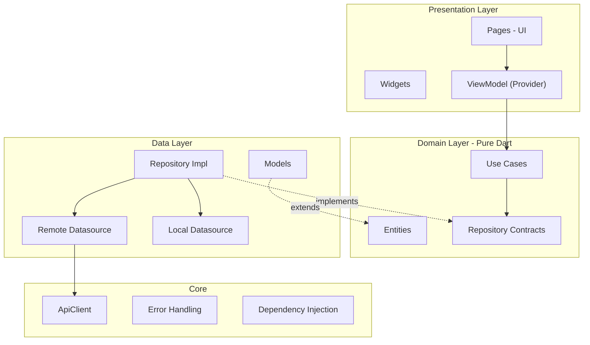

# Technical Requirements Document (TRD)

Dokumen ini memuat detail teknis esensial untuk pengembangan project `news-app-mvvm`. Saat ini baru dibahas dua bagian utama: **Spesifikasi Project** dan **Dokumentasi Dependencies**.

---

## 🏗️ Bagian 1: Spesifikasi Project

- **Nama Project**: `news-app-mvvm`
- **Pola Arsitektur**: Clean Architecture (Domain, Data, Presentation)
- **State Management**: MVVM (Model-View-ViewModel) menggunakan `provider` & `ChangeNotifier`. Dilarang menggunakan BLoC.
- **TDD (Test-Driven Development)**: Wajib diimplementasikan pada setiap fitur (Mulai dari Model -> Repository -> ViewModel).
- **Format Respons API**: Di-handle dengan konsep Functional Programming (`Either` pattern).
- **Routing**: Deklaratif menggunakan `go_router`.

### 1.1 Flow Architecture (Clean Architecture + MVVM)

Aplikasi mengikuti **Clean Architecture** murni dengan pergerakan panah dependensi sebagai berikut:

**Prinsip Komunikasi Antar Layer:**
- **Presentation** (UI & ViewModel) hanya boleh ngobrol dengan **Domain** (UseCase/Repository). *Haram* hukumnya ViewModel manggil ApiClient langsung.
- **Data** mengimplementasikan Request dari Domain.
- **Domain** adalah si Bos, dia murni algoritma Dart dan nggak peduli Flutter, Firebase, atau API itu apa.

---

## 📦 Bagian 2: Dokumentasi Dependencies

Berikut adalah penjelasan daftar pustaka (package) pihak ketiga yang diinstal pada project ini beserta perannya:

## 🏗️ 1. State Management & arsitektur
### `provider` (v6+)
- **Peran:** Mengelola state pada lapisan *Presentation* (sebagai penghubung View dan ViewModel).
- **Justifikasi Alasan:** Sesuai kesepakatan desain, BLoC digantikan dengan Provider. Kombinasi `ChangeNotifier` (bawaan Flutter) sangat ringan, natural, dan mudah dimengerti untuk penerapan MVVM murni. Pengecekan state cukup dengan `context.watch<ViewModel>()`.
- **Lokasi Pemakaian:** Sepenuhnya di `presentation/viewmodels/` dan `presentation/views/`.

---

## 📡 2. Jaringan & Komunikasi Data
### `dio` (v5+)
- **Peran:** HTTP Client untuk menembak API dan mengambil data.
- **Justifikasi Alasan:** Sangat powerful karena mendukung *Interceptors* (enak untuk nyisipin Token Authorization global), manipulasi Form Data yang mudah, serta *Timeout handling* yang stabil dibanding `http` biasa.
- **Lokasi Pemakaian:** Hanya di `data/datasources/remote_datasource.dart`.

---

## 🧱 3. Functional Programming & Struktur
### `dartz` (v0.10+)
- **Peran:** Menangani Error dan Response Handling terpadu (Functional Programming).
- **Justifikasi Alasan:** `dartz` membawa tipe data `Either<L, R>`. Fitur ini memaksa developer untuk **secara sadar** menghandle dua kemungkinan kembalian fungsi: `Left` (kalau gagal/Error) dan `Right` (kalian berhasil/Success). Exception tidak akan meledak merusak UI secara gaib karena tertangkap rapi oleh *Failure class*. 
- **Lokasi Pemakaian:** `domain/repositories/` dan `presentation/viewmodels/`.

### `equatable` (v2+)
- **Peran:** Mengeksekusi perbandingan "Value Equality" secara instan.
- **Justifikasi Alasan:** Seperti yang dijelaskan sebelumnya, Dart ngecek lokasi memori, bukan isi objek. Di arsitektur Clean yang mewajibkan objek diubah-ubah bentuknya layaknya Transformer (JSON -> Model -> Entity), Equatable wajib ada biar kita gak capek bikin override `==` manual, dan Unit Test (`expect`) tidak selalu `false`.
- **Lokasi Pemakaian:** Hampir semua kelas (khususnya `data/models/` dan `domain/entities/`).

---

## 🧭 4. Dependency Injection (Mencari Objek Secara Global)
### `get_it` (v9+)
- **Peran:** Service Locator (Mendaftarkan dan Mencarikan instance secara global).
- **Justifikasi Alasan:** MVVM itu merangkai objek (View butuh ViewModel, ViewModel butuh UseCase/Repository, Repository butuh DataSource, DataSource butuh Dio). Mengoper instance berlapis-lapis lewat *constructor/param* sungguh melelahkan. Dengan `get_it`, kita tinggal panggil `sl<MyViewModel>()`, dan *BAM!* semua dependency di dalamnya otomatis dibikinin.
- **Lokasi Pemakaian:** File `injection_container.dart` dan injeksi di UI / Routes.

---

## 🧪 5. Testing Tools (Lingkungan Dev)
### `mocktail` (v1+)
- **Peran:** Mocking/Memalsukan Objek untuk TDD.
- **Justifikasi Alasan:** Karena kita gak mungkin ngetes Unit Test dengan nyambung internet/DB sungguhan (kasihan tagihan server dan test-nya jadi lambat!), kita gunakan `mocktail` untuk membuat *Objek Kembaran Tiruan*. Kembaran ini bisa disuruh *"Heh! Nanti kalau fungsi A kepanggil, pura-puranya lo balikin nilai 500 ya!"* Cara kerjanya lebih luwes dan simpel dibanding `mockito` (karena tidak perlu Code Generation / build runner yang lama).
- **Lokasi Pemakaian:** Sisi folder `test/.../`.

---

## 🗺️ 6. Navigasi & Routing
### `go_router` (v14+)
- **Peran:** Mengatur perpindahan layar (Routing) secara deklaratif dan mendukung Deep Linking.
- **Justifikasi Alasan:** `go_router` adalah router resmi yang direkomendasikan oleh tim Flutter (Google). Sangat cocok dan mudah dipadukan dengan *Dependency Injection* karena kita cukup mendefinisikan seluruh `Route` di satu file Core terpusat, lalu pindah layar cukup dengan `context.go('/home')`. Lebih rapi ketimbang fungsi bawaan `Navigator.push`.
- **Lokasi Pemakaian:** `core/routes/` dan dieksekusi di seluruh UI lapis `presentation/`.
