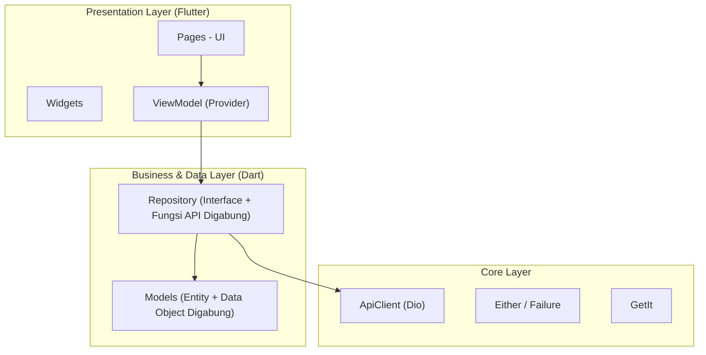

# Technical Requirements Document (TRD)

## News App MVVM — Flutter Mobile Application

| Field | Value |
|-------|-------|
| **Project Name** | News App MVVM |
| **Platform** | Flutter (iOS & Android) |
| **Architecture**| Pragmatic Clean Architecture |
| **State Mgt.**  | MVVM (Model-View-ViewModel) + Provider |
| **Version** | 1.0.0 |
| **Status** | In Development |

---

## Table of Contents

1. [Overview & Specifications](#1-overview--specifications)
2. [System Architecture](#2-system-architecture)
3. [Technology Stack and Library Selection](#3-technology-stack-and-library-selection)

---

## 1. Overview & Specifications

### 1.1 Purpose
Aplikasi ini adalah platform manajemen berita berbasis mobile yang dikembangkan menggunakan framework Flutter. Arsitektur aplikasi ini murni dibangun dengan pendekatan **MVVM (Model-View-ViewModel)** yang praktis, menggunakan `provider` sebagai state management. Aplikasi secara ketat mempertahankan dan menjunjung tinggi prinsip Test-Driven Development (TDD) pada core logic.

### 1.2 Core Specifications

| Category | Specification Constraints |
|----------|---------------------------|
| **Architecture Pattern** | Pragmatic Clean Architecture (Dipersingkat menjadi 4 Lapisan). |
| **State Management** | MVVM menggunakan package `provider` & `ChangeNotifier`. |
| **Testing Requirement**| Wajib TDD (Red-Green-Refactor) pada ViewModel & Repository layer. |
| **Network Response** | Wajib dibungkus dengan `Either<Failure, T>` constraint. |

---

## 2. System Architecture

### 2.1 Pragmatic MVVM Flow

Aplikasi mengikuti **Pragmatic Clean Architecture**. Struktur disederhanakan dari standar 8 layer penuh menjadi 4 layer esensial demi mempercepat *development* namun tanpa mengorbankan _testability_ UI/ViewModel.

### 2.2 Dependency Rule

- **Presentation (UI & ViewModel):** Hanya boleh berkomunikasi dengan Repository. *Haram* hukumnya ViewModel memanggil ApiClient langsung.
- **Repository:** Bertugas mengkonsumsi ApiClient secara absolut, mem-parsing response menjadi Models. (UseCase dipangkas khusus untuk iterasi project ini).
- **Models:** Berfungsi ganda sebagai wadah Serialisasi JSON sekaligus menjunjung kontrak *Value-Equality* murni.

---

## 3. Technology Stack and Library Selection

### 3.1 Network & Communication

| Library | Version | Justification | Alternatif yang Dipertimbangkan |
|---------|---------|---------------|-------------------------------|
| **dio** | ^5.9.2 | Powerful HTTP client dengan interceptor untuk log dan otorisasi terpusat. | `http` — terlalu basic, tidak memiliki interceptor bawaan. |

### 3.2 State Management & Architecture

| Library | Version | Justification | Alternatif yang Dipertimbangkan |
|---------|---------|---------------|-------------------------------|
| **provider** | ^6.1.5 | State management ringan dan *native-like* yang dirancang murni untuk *Method-driven* architecture seperti MVVM. Reaktivitasnya instan menggunakan kumpulan `ChangeNotifierProvider` dan `Consumer`. | Pustaka `ValueNotifier` bawaan manual dinilai terlalu terbatas dan sulit untuk mensuplai *Dependency* ke seluruh hierarki widget secara terpusat. |
| **equatable** | ^2.0.8 | Memastikan komparasi *Value Equality* instan pada Object, sangat vital bagi kredibilitas Unit Test dan *Mocking*. | *Override manual* `==` dan `hashCode` — Terlalu rentan *human-error* dan memperlambat *development*. |
| **dartz** | ^0.10.1 | Functional programming mutlak untuk menangkap Failure dan Success response melalui pattern `Either<L,R>`. | *Exception (try/catch)* — Dihindari demi visibilitas code, mencegah UI *crash* mendadak. |

### 3.3 Routing & Navigation

| Library | Version | Justification | Alternatif yang Dipertimbangkan |
|---------|---------|---------------|-------------------------------|
| **go_router** | ^17.2.0 | Deklaratif routing resmi yang mensupport *Deep Linking* dan penanganan *Auth Redirection* layaknya web konvensional. | `auto_route` — Overkill untuk aplikasi berskala menengah karena melibatkan *code generation* yang masif. |

### 3.4 Dependency Injection (Service Locator)

| Library | Version | Justification | Alternatif yang Dipertimbangkan |
|---------|---------|---------------|-------------------------------|
| **get_it** | ^9.2.1 | Cara paling simpel untuk mendaftarkan dan menemukan objek `Repository` atau `ViewModel` secara instan dari manapun di *Widget Tree*. | *Constructor Passing (Manual Di)* — Sangat melelahkan untuk hierarki widget yang sangat dalam. |

### 3.5 Development & Testing Tools

| Library | Version | Justification |
|---------|---------|---------------|
| **mocktail** | ^1.0.4 | Digunakan untuk melahirkan kembaran palsu/tiruan (Mocks) dari Repository layaknya Objek sungguhan pada TDD. Tanpa *build_runner*. |
