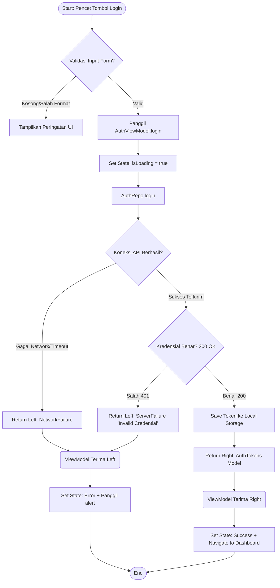
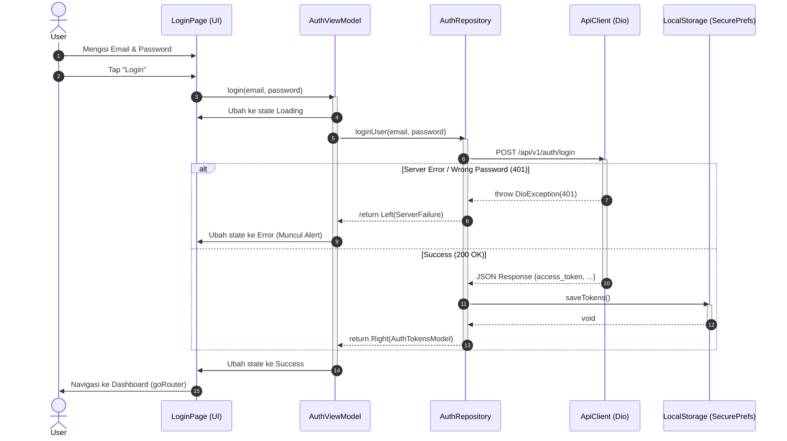

# Spesifikasi Desain Fitur: Authentication (Login)

Dokumen ini menjelaskan rancangan alur fungsional dan teknis untuk fitur **Login** di aplikasi `news-app-mvvm` sesuai dengan *Pragmatic Clean Architecture (MVVM)*.

---

## 1. Flowchart Login
Flowchart ini menggambarkan *decision checking* secara proses fungsional yang dialami oleh fitur Login dari input user hingga selesai.

---

## 2. Sequence Diagram Login
Diagram ini menggambarkan interaksi langsung antar komponen di setiap layer (4-layer murni) demi mempertahankan *Separation of Concern*.

