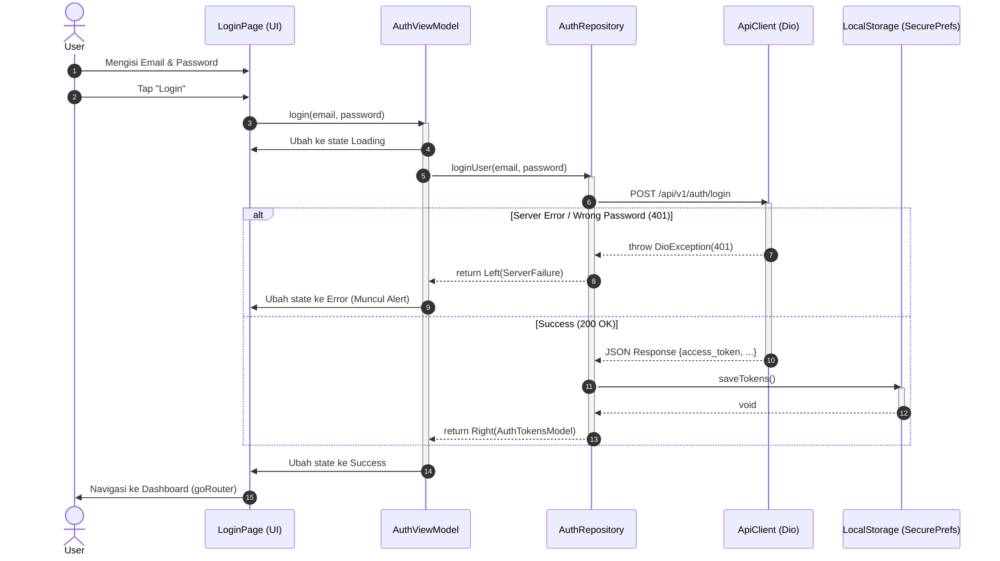

# Spesifikasi Desain Fitur: Authentication (Login)

Dokumen ini menjelaskan rancangan alur fungsional dan teknis untuk fitur **Login** di aplikasi `news-app-mvvm` sesuai dengan *Pragmatic Clean Architecture (MVVM)*.

---

## 1. Flowchart Login (User & Business Flow)
Flowchart ini **murni** menggambarkan alur perjalanan pengguna (User Journey) dan Keputusan Sistem pada interaksi antarmuka (UI). Tidak dicampur dengan istilah teknis (*class/layer*).

```mermaid
graph TD
    A([Start: User Menekan Tombol Login]) --> B{Validasi Input Form?}
    
    B -- Kosong/Format Salah --> C[Sistem Memunculkan Peringatan Validasi]
    
    B -- Format Valid --> D[Sistem Menampilkan Indikator Loading]
    D --> E[Sistem Melakukan Autentikasi ke Server]
    
    E --> F{Status Koneksi & Respon?}
    F -- Mode Pesawat/Timeout --> G[Sistem Memunculkan Alert Gangguan Jaringan]
    F -- Tersambung ke Server --> H{Pengecekan Kredensial}
    
    H -- Salah (401) --> I[Sistem Memunculkan Alert Salah Email/Password]
    H -- Berhasil (200) --> J[Sistem Menyimpan Sesi (Token Lokal)]
    
    C --> O([Flow Selesai])
    G --> O
    I --> O
    
    J --> N[Sistem Mengarahkan User ke Dashboard]
    N --> P([Flow Selesai & Berhasil])
```

---

## 2. Sequence Diagram Login
Diagram ini menggambarkan interaksi langsung antar komponen di setiap layer (4-layer murni) demi mempertahankan *Separation of Concern*.


